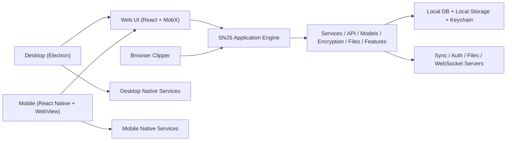

# MiraNotes / Standard Notes Fork Audit

Audit date: 2026-04-02

## Executive Summary

This repository is not a small custom note-taking app. It is a large, production-grade fork of the Standard Notes client monorepo, with most of the original product architecture still intact. The codebase already supports far more than basic notes: end-to-end encrypted sync, account sessions, files, multiple editors and themes, subscription gating, browser clipping, note publishing, vaults and shared vaults, self-hosting support, desktop and mobile wrappers, and a broad set of backup and import flows.

The core architectural pattern is strong and deliberate:

- `packages/snjs` is the shared application engine and business-logic layer.
- `packages/web` is the main UI product surface and the most important app package.
- `packages/desktop` is an Electron shell around the web app plus native desktop services.
- `packages/mobile` is a React Native shell that embeds the built web app inside a WebView and bridges native device APIs into it.
- Supporting packages (`api`, `services`, `encryption`, `models`, `files`, `features`, `ui-services`, `sncrypto-*`, etc.) split protocol, storage, API, crypto, and feature logic into reusable layers.

From a maintainability perspective, this is a serious codebase with a lot of reusable value, but it is also complex enough that future upgrades should be planned carefully. The highest-value observations are:

1. This is still heavily Standard Notes-branded and Standard Notes-connected.
   Source inspection found Standard Notes identifiers, URLs, bundle IDs, and related strings in over 1,300 files. This includes product copy, package names, sync endpoints, purchase URLs, app links, bundle IDs, deep link schemes, workflow tags, and CI/release metadata. If MiraNotes is intended to become a standalone product, rebranding and service decoupling is a major project, not a cosmetic cleanup.

2. The web app is the true center of gravity.
   Desktop and mobile are both wrappers around the web experience. If you want to change product behavior, most of your important work will happen in `packages/web`, `packages/snjs`, and the shared service packages.

3. Security and privacy are first-class design goals.
   The repo is built around client-side encryption, root keys, items keys, passcode wrapping, MFA, WebAuthn/U2F, biometrics, protected notes/files, session management, and secure storage abstractions. This is one of the strongest parts of the architecture.

4. The feature surface is much broader than "notes".
   The project includes files, backups, importers, publishers, plugins, themes, editors, vaults, shared vault collaboration, browser clipping, subscription invitations, offline entitlements, and even a desktop-managed local home server.

5. Some upgrade friction is already visible.
   The repo mixes older engine declarations with a newer `.nvmrc`, uses a very large monorepo with deep cross-package dependencies, still relies on some legacy or high-risk platform mechanisms (for example `@electron/remote`, plugin zip installs, permissive mobile file/webview settings in specific places), and contains a few implementation details worth reviewing before treating the fork as production-ready under a new brand.

This audit is a repository and architecture audit, not a runtime penetration test. It is intended as a code reference for future upgrades, onboarding, and strategic decisions.

---

## Scope And Method

The audit covered:

- Root repo configuration, workspace layout, scripts, and CI/CD.
- Package inventory under `packages/`.
- Main application entrypoints and shell architecture for web, desktop, mobile, and clipper.
- Shared runtime layers in `snjs`, `services`, `api`, `encryption`, `files`, `features`, `models`, and `ui-services`.
- Security-oriented code paths around encryption, storage, passcodes, biometrics, MFA, authenticators, sessions, and protected content.
- Integration points such as Standard Notes servers, WebSockets, purchase flows, home server support, mobile share extensions, and plugin loading.
- Testing footprint and release automation.

Useful repo facts:

- Monorepo package count: 21 packages
- Files inside `packages/`: 2,994 files
- Dominant source languages: TypeScript (`.ts` 1,631 files, `.tsx` 518 files)
- Detected test files/pages: 220
- Largest packages by file count:
  - `web`: 813 files
  - `services`: 305 files
  - `snjs`: 303 files
  - `models`: 287 files
  - `mobile`: 187 files
  - `api`: 157 files
  - `desktop`: 117 files

---

## What This Repo Actually Is

At the root level this repository is still Standard Notes' app monorepo:

- Root package name: `@standardnotes/app-monorepo`
- Workspace manager: Yarn 3 workspaces with `node-modules` linker
- Release management: Lerna with independent package versioning
- Main workspace rule: internal workspace dependencies are enforced to use `workspace:*`

Important root files:

- `package.json`: root scripts and workspace definitions
- `.yarnrc.yml`: Yarn configuration
- `lerna.json`: independent versioning + workspaces
- `constraints.pro`: enforces workspace dependency conventions
- `.env.sample`: default sync server and subscription URLs
- `.github/workflows/*`: PR validation, release automation, CodeQL, mobile/desktop/web release flows
- `SECURITY.md`: disclosure policy

Version/tooling notes:

- Root `package.json` engine says `>=12.19.0 <17.0.0`
- Many packages say `>=16.0.0 <17.0.0`
- `.nvmrc` is `22.14.0`

That version mismatch is important. It suggests the repository evolved over time and the declared engines are not fully aligned with the current preferred local runtime. Treat toolchain standardization as an upgrade task.

---

## High-Level Architecture

### Core pattern

The codebase is layered rather than flat:

- UI shell layer:
  - Web UI in `packages/web`
  - Electron shell in `packages/desktop`
  - React Native shell in `packages/mobile`
  - Browser extension in `packages/clipper`

- Shared app engine layer:
  - `packages/snjs`

- Shared domain/support layers:
  - `packages/services`
  - `packages/api`
  - `packages/encryption`
  - `packages/files`
  - `packages/features`
  - `packages/models`
  - `packages/responses`
  - `packages/ui-services`
  - `packages/sncrypto-common`
  - `packages/sncrypto-web`
  - `packages/utils`

This is a good architecture for cross-platform parity. It avoids duplicating sensitive business logic in each client. The tradeoff is complexity: many behaviors only make sense when you understand the interaction between `web`, `snjs`, `services`, and the device abstraction for the current platform.

---

## Package Map

### End-user products

| Package | Purpose | Notes |
|---|---|---|
| `web` | Main note app UI | React app, primary product surface |
| `desktop` | Electron desktop app | Wraps web app, adds native desktop services |
| `mobile` | React Native mobile app | Embeds web bundle in WebView with native bridge |
| `clipper` | Browser extension | Clips selections, articles, pages, screenshots |

### Shared runtime and domain packages

| Package | Purpose | Notes |
|---|---|---|
| `snjs` | Shared app engine | Central app lifecycle, sync, encryption, sessions, services wiring |
| `services` | Cross-domain service contracts and use cases | Rich domain layer split by concern |
| `api` | HTTP/WebSocket client wrappers | Auth, user, subscription, revision, shared vault, websocket endpoints |
| `encryption` | Protocol/key logic | Root keys, items keys, backup encryption helpers |
| `files` | File transfer + backup helpers | Chunking, caching, file system APIs, backup reads |
| `features` | Feature entitlement SDK | Native feature identifiers, roles, permissions |
| `models` | Shared runtime models | Notes, tags, files, vaults, contacts, payloads |
| `responses` | Response types | Network response shapes and helpers |
| `ui-services` | UI-domain services | Importers, plugin service, route parsing, autolock, theme helpers |
| `sncrypto-common` | Crypto interfaces/types | Base crypto abstractions |
| `sncrypto-web` | Web crypto implementation | Web/libsodium-backed crypto package |
| `utils` | Shared utilities | Helpers used across packages |

### UI and support packages

| Package | Purpose | Notes |
|---|---|---|
| `filepicker` | File save/open abstraction | Streaming and classic browser file APIs |
| `icons` | SVG icon set | Large package by file count |
| `styles` | Shared styling assets | Shared visual primitives |
| `toast` | Toast system | Shared notification UI |
| `releases` | Release metadata packaging | Builds release JSON from app versions |

---

## Runtime Architecture In More Detail

### 1. `snjs` is the real application engine

`SNApplication` in `packages/snjs/lib/Application/Application.ts` is the runtime center of the whole app family.

Responsibilities handled there:

- app startup and launch stages
- storage initialization and decryption
- session restoration and sign-in/sign-out flows
- syncing and auto-sync
- encryption initialization and key management
- passcode operations
- MFA and authenticator use cases
- file services
- revisions
- preferences and settings
- vaults, contacts, shared vaults
- challenge/authorization flows
- websocket setup

This is not a thin helper library. It is effectively the platform-agnostic product core.

### 2. Dependency injection is central

`packages/snjs/lib/Application/Dependencies/Dependencies.ts` builds a very large service graph. It wires together:

- storage
- payload and item managers
- mutators
- encryption services
- sessions
- sync
- subscriptions
- features
- files
- listed publishing
- MFA
- authenticators
- home server
- vaults/shared vaults
- contacts/asymmetric messages
- backups
- revisions

This is one of the best files to study first if you want to understand the product as a system.

### 3. Web is the primary front-end

The web client boot path is:

- `packages/web/src/javascripts/index.ts`
- `packages/web/src/javascripts/App.tsx`
- `packages/web/src/javascripts/Application/WebApplicationGroup.ts`
- `packages/web/src/javascripts/Application/WebApplication.ts`

`WebApplication` extends `SNApplication` and adds web-specific controllers and UI concerns:

- notes controller
- item list controller
- navigation controller
- files controller
- features/subscription/purchase controllers
- import modal controller
- sync status controller
- account menu controller
- preferences controller
- command palette
- theme manager
- autolock service
- route service
- moments service

Tech used in the web package:

- React 18
- MobX / mobx-react-lite
- Tailwind CSS + Sass
- Webpack
- Lexical editor packages
- Ariakit and Radix UI primitives
- `@simplewebauthn/browser`
- `qrcode.react`
- `@react-pdf/renderer`
- `@zip.js/zip.js`

### 4. Desktop is a secure wrapper plus native service host

Desktop is not a separate UI stack. It wraps the web app inside Electron and exposes native capabilities through a preload/bridge pattern.

Key desktop responsibilities:

- window lifecycle and shell chrome
- keychain access through `keytar`
- package/plugin management
- spellcheck management
- tray support and minimize-to-tray
- update management with `electron-updater`
- file backups and watched directories
- media permissions
- local home server control
- external component serving over localhost

Hardening-relevant Electron settings from `Window.ts`:

- `contextIsolation: true`
- `sandbox: true`
- `preload: Paths.preloadJs`
- `nodeIntegration: isTesting()`

Desktop also routes all external `http`, `https`, and `mailto` links to the OS browser instead of opening them inside the app.

### 5. Mobile is a hybrid: native shell + embedded web app

The mobile client is a React Native app, but the actual note app UI is the built web app loaded inside a WebView:

- `packages/mobile/src/MobileWebApp.tsx`
- `packages/mobile/src/MobileWebAppContainer.tsx`

The React Native side injects a device interface into the web runtime and handles:

- keychain storage
- biometrics
- Android screenshot privacy
- file open/share/download
- iOS share extension handoff
- notifications
- app state and keyboard events
- color scheme events
- purchase IAP
- review prompts
- custom Android WebView behavior

This design keeps feature logic shared, but it also means mobile debugging and upgrades often touch both React Native code and web code.

### 6. Browser clipper is a separate product surface

The clipper package supports:

- clipping current selection
- clipping full page HTML
- extracting article content via Mozilla Readability
- selecting a specific DOM node to clip
- screenshot mode for visible tab or selected node

The popup bundle points at Standard Notes endpoints by default:

- sync server: `https://api.standardnotes.com`
- files host: `https://files.standardnotes.com`
- websocket: `wss://sockets.standardnotes.com`
- purchase/plans/dashboard URLs under `standardnotes.com`

---

## Technologies Used

### Frontend and UI

- React 18 on web
- React Native 0.78.1 on mobile
- React 19 in the mobile package
- MobX for state management
- Tailwind + Sass in web UI
- Lexical and shipped editor packages for rich editing
- custom component/plugin iframe system

### Desktop

- Electron 35.2.0
- electron-builder
- electron-updater
- keytar
- electron-log

### Mobile

- react-native-webview
- react-native-keychain
- react-native-fingerprint-scanner
- react-native-iap
- react-native-mmkv
- notifee
- react-native-file-viewer
- react-native-share
- react-native-privacy-snapshot
- react-native-flag-secure-android

### Crypto and protocol

- libsodium-wrappers
- `sncrypto-common`
- `sncrypto-web`
- Argon2id for key derivation
- XChaCha20-Poly1305 for encryption
- SHA-256 helpers
- AES-GCM interfaces in shared crypto types

### Tooling and DX

- Yarn 3.2.1
- Lerna
- TypeScript 5.8.3 at root
- Webpack
- Jest
- AVA in desktop
- ESLint
- Prettier
- Commitlint

### CI/CD and operational tooling

- GitHub Actions
- Dependabot
- CodeQL
- AWS S3 + CloudFront for web deployment
- Discord webhook notification workflow

---

## Product Capabilities

## Core notes and organization

The app supports:

- encrypted notes
- tags
- nested tags / folders
- smart views / smart filters
- pinned notes
- archived notes
- trashed notes
- multiple note types
- note linking and linked items
- note history / revisions
- multi-selection flows
- search options and filtering
- command palette

The web UI shows strong evidence of a mature note UX:

- dedicated note history controller and revision modal
- search options UI
- navigation controller
- note grouping and item group controller
- change-editor flow
- protected item overlays

## Editors, themes, plugins, and extensibility

Built-in component packages referenced by the repo include:

- Authenticator
- Bold editor
- Classic code editor
- Markdown basic
- Markdown hybrid
- Markdown math
- Markdown minimal
- Markdown visual
- Rich text
- Simple task editor
- Spreadsheets

Shipped themes include:

- Proton
- Autobiography
- Dynamic
- Focus
- Futura
- Midnight
- Solarized Dark
- Titanium

Plugin/package capabilities:

- browse plugins
- install custom plugins/packages
- manage installed plugins
- desktop package manager downloads and unzips plugin packages
- desktop local extension server serves installed components from disk

This means the app is intentionally extensible, not a closed fixed editor.

## Files and media

The project has a full file subsystem, not just "attach a blob to a note".

Capabilities found in code:

- file upload with chunking
- file download with decryption
- local encrypted cache
- file preview
- file rename
- file delete
- file protection/unprotection
- note-to-file linking
- vault-aware file handling
- streaming browser save support
- zip download of multiple files
- Android progress notifications for upload/download
- backup reads from local file backups

Desktop and mobile add more:

- desktop file backups
- desktop plaintext note backups
- desktop text backups
- mobile native file viewer
- mobile share/download handling

## Backups and import/export

Backup-related capabilities found in code and UI:

- encrypted data backups
- decrypted backups
- email backups UI
- file backups
- plaintext note backups
- text backups
- zip exports for files

Import capabilities:

- Aegis authenticator imports
- Evernote imports
- Google Keep imports
- Simplenote imports
- HTML imports
- plaintext imports
- Super format imports/conversions

This is a strong interoperability surface and one of the better long-term value areas in the repo.

## Publishing

Listed publishing is built in:

- dedicated `ListedService` in the shared layer
- Listed preferences pane
- Listed actions in note menus
- note authorization flow for Listed publishing

This means the app can act as both a private notes app and a lightweight publishing platform.

## Vaults and collaboration

The repo supports a substantial vault and shared-vault model.

Capabilities found:

- create vaults
- create password-backed vaults
- move items to and from vaults
- vault metadata editing
- vault key rotation
- vault storage mode changes
- vault lock validation
- shared vault creation
- convert vault to shared vault
- trusted contacts
- contact sharing with vaults
- shared vault invites
- shared vault member/user syncing
- notifications for removed users, file changes, key rotation, and survivor designation

This is significantly more advanced than simple shared notebooks. The code suggests a cryptographic collaboration model centered around shared keys and trusted contacts.

## Accounts, subscriptions, and monetization

The app includes:

- account registration
- sign-in
- sign-out
- account deletion
- email change
- password change
- session listing/revocation
- subscription fetch and display
- subscription invitations
- invitation acceptance/canceling
- offline feature entitlement codes
- purchase flow URLs
- iOS in-app purchases with server confirmation

Feature entitlement is role-driven. The app distinguishes between:

- first-party online subscriptions
- first-party offline subscriptions
- third-party/offline entitlement codes
- role-based feature access

This is important for future upgrades because many capabilities are not simply toggled by UI; they are modeled as entitlements in the shared feature layer.

## Browser clipping and inbound sharing

The repo supports multiple inbound content capture paths:

- browser clipper extension
- mobile share sheet ingestion for files, URLs, and text
- iOS share extension with app-group handoff
- Android `SEND` / `SEND_MULTIPLE` intent filters

The mobile bridge then converts inbound content into uploaded files or newly created notes.

## Self-hosting and custom infrastructure

The app supports:

- configurable default sync server via env
- custom host selection in the UI
- local/desktop Home Server control
- offline entitlements repo support
- local network access for mobile self-hosting scenarios

The desktop package integrates `@standardnotes/home-server` and can:

- generate a home-server configuration
- start/stop the home server
- expose its local URL
- manage logs
- set data location
- activate premium features on home server

This is one of the more distinctive capabilities in the repo.

---

## Authentication, Encryption, And Security Model

## Encryption model

The project includes a protocol specification document in `packages/snjs/specification.md`. The core model is:

- user password -> root key
- root key split into:
  - `masterKey`
  - `serverPassword`
- per-account items keys encrypt synced data
- per-item item keys encrypt each note/file payload
- local storage is encrypted when encryption sources exist
- optional passcode wraps the root key locally

Protocol highlights:

- protocol version: v004
- KDF: Argon2id
- encryption: XChaCha20-Poly1305
- progressive key rotation model
- strict sign-in mode to resist malicious protocol downgrade
- key recovery flow for stale items keys

This is a thoughtful zero-knowledge model. The server stores encrypted data and never needs the local master key.

## Local protection model

The project supports:

- account passwords
- local passcodes
- biometrics
- protected notes
- protected files
- time-limited unprotected sessions
- mobile-specific unlock timing preferences
- screenshot privacy on mobile

`ProtectionService` is responsible for enforcing extra authentication before protected actions such as:

- accessing protected notes/files
- changing passcodes
- removing passcodes
- searching protected notes text
- creating backups
- disabling MFA
- revoking sessions
- publishing to Listed
- deleting accounts

## MFA and authenticators

The authentication surface is broader than email + password.

The repo includes:

- TOTP MFA secret generation and activation
- MFA disable flow requiring password authorization
- recovery codes use cases
- authenticator listing/deletion
- WebAuthn/U2F registration and authentication options
- authenticator naming persisted in preferences

Platform notes:

- Web uses `@simplewebauthn/browser`.
- Mobile has a native `Fido2ApiModule` path for authentication.
- `WebApplication` explicitly notes that full security-key registration is only fully supported on web browser clients.

## Sessions and account lifecycle

The shared runtime supports:

- session restore
- session revoke
- revoke all other sessions
- session expiration handling
- corrective sign-in when keys drift
- merge-local vs replace-local behavior on sign-in
- ephemeral sessions / ephemeral persistence

This is one reason the app feels like a real encrypted account product rather than a local-only notes app.

---

## Platform-Specific Security Notes

## Web

Strengths:

- the main security model lives in shared code, not UI-only code
- local data can be protected with passcode wrapping
- component iframes are sandboxed
- protocol logic explicitly addresses downgrade and key-recovery cases

Important caveats:

- `WebDevice` stores keychain-like data in browser `localStorage`
- `WebOrDesktopDevice` also relies on `localStorage` for raw storage on web/desktop web mode
- without a passcode, browser environments cannot rely on a true OS keychain

That is not a bug by itself, but it means the web client's local-at-rest guarantees depend heavily on whether a passcode is configured and what the browser environment allows.

## Desktop

Strengths:

- Electron window uses `contextIsolation: true` and `sandbox: true`
- preload bridge model is used
- external links are opened outside the app
- extension file paths are normalized in the local extension server to reduce path traversal risk
- `keytar` is used for keychain storage where available
- Electron builder config includes macOS hardened runtime and notarization

Important caveats / review notes:

- The app still uses `@electron/remote`, which is a legacy-sensitive area in Electron apps and worth reevaluating during modernization.
- Desktop plugin packages are downloaded, extracted, and served locally. This is a deliberate feature, but it increases trust and supply-chain exposure.
- The desktop home server configuration file contains highly sensitive secrets. The metadata written by `HomeServerManager` says the values are encrypted, but the implementation path currently writes plain JSON via `FilesManager.writeJSONFile`. That deserves immediate verification before relying on the claim.

## Mobile

Strengths:

- iOS keychain uses `WHEN_UNLOCKED_THIS_DEVICE_ONLY`
- Face ID / fingerprint / biometrics support exists
- screenshot privacy controls exist
- ATS is enabled on iOS (`NSAllowsArbitraryLoads` is false)
- iOS app-group and associated domain entitlements are configured
- Android network security config only permits cleartext for local/self-hosted addresses like `localhost`, emulator loopbacks, and `127.0.0.1`

Important caveats / review notes:

- Android manifest sets `android:allowBackup="true"`. That may be acceptable depending on product policy, but it should be intentionally reviewed.
- Android still requests `requestLegacyExternalStorage="true"` and old write-storage permissions for older SDK levels.
- The mobile WebView enables `allowUniversalAccessFromFileURLs={true}`. This is probably necessary for the embedded local web bundle and components, but it is a higher-risk setting and should remain under review.

## Plugins and component sandboxing

The plugin system is one of the biggest security-sensitive areas in the whole app.

Positive controls:

- iframe sandbox attributes are used
- native/mobile same-origin allowance is only added for native shipped components
- desktop extension serving normalizes file paths and restricts served locations

Still important:

- plugin/editor/theme code is a code execution surface by design
- desktop package installs are remote zip downloads
- sandbox attributes still allow scripts, forms, popups, downloads, and user-activated top navigation

This does not mean the feature is unsafe by default, but it means plugin trust and update provenance should be treated as a core product policy decision.

## Repo-level security operations

The repo also includes:

- `SECURITY.md` disclosure process
- CodeQL scanning against web and desktop code
- Dependabot for root and nearly every package
- CI build/lint/test workflow

This is a good baseline for an open-source monorepo of this size.

---

## Integrations And External Dependencies

## First-party service integrations

The codebase is wired for Standard Notes infrastructure by default:

- sync/auth server: `https://api.standardnotes.com`
- dashboard: `https://standardnotes.com/dashboard`
- plans: `https://standardnotes.com/plans`
- purchase: `https://standardnotes.com/purchase`
- clipper files host: `https://files.standardnotes.com`
- clipper websocket: `wss://sockets.standardnotes.com`
- web app launch URL in manifest: `https://app.standardnotes.com`
- iOS/Android associated-domain and asset-link files for Standard Notes identifiers
- deep link scheme on desktop: `standardnotes://`

Implication:

This repo is not currently neutral infrastructure-wise. It defaults to the Standard Notes ecosystem unless you deliberately replace or override those values.

## Server/API integrations

API wrappers exist for:

- auth
- user
- user requests
- subscriptions
- revisions
- shared vaults
- shared vault invites
- shared vault users
- asymmetric messages
- authenticators
- websockets

This is a strong sign that the app expects a fairly rich backend API, not just a simple note sync endpoint.

## OS and platform integrations

Desktop:

- system keychain via `keytar`
- spellcheck dictionaries download
- tray/menu integration
- auto-update system
- media permissions
- filesystem access
- local home server control

Mobile:

- keychain
- biometrics / Face ID / fingerprint
- notifications
- app state observers
- native sharing
- file viewer
- review prompts
- IAP
- status bar + privacy snapshot handling

Browser/web:

- File System Access API
- browser extension APIs
- WebAuthn
- PWA/app-link metadata

## Third-party library and service integrations

Examples found in code:

- Mozilla Readability
- SimpleWebAuthn
- electron-updater
- AWS S3 + CloudFront deployment workflow
- Discord webhook release notification
- react-native-iap
- notifee
- libsodium

---

## Preferences And Configurable Areas

Main preferences panes discovered in the web UI:

- Account
- Appearance
- Backups
- General
- HomeServer
- Listed
- Plugins
- Security
- Vaults
- WhatsNew

Notable subareas:

- Security:
  - Two-factor auth
  - U2F / authenticators
  - Biometrics
  - Encryption/protocol upgrade UI
  - Multitasking/privacy settings
  - Passcode
  - Protected note/file settings

- Backups:
  - Data backups
  - Email backups
  - File backups
  - Plaintext backups
  - Text backups

- Vaults:
  - Vault management
  - Contacts
  - Invites

- Home Server:
  - Status
  - Settings

- Plugins:
  - Browse plugins
  - Install custom plugin/package
  - Manage plugins

This is helpful when planning future upgrades because much of the product surface is already exposed in settings rather than hidden behind code-only toggles.

---

## CI, Release, And Operational Maturity

The repo has a serious release/ops setup:

- PR workflow builds all packages, runs lint, bundles Android, and runs tests
- dedicated release workflows for:
  - web
  - desktop
  - mobile
  - clipper
  - iOS TestFlight / SDK verification
  - release notifications

Web deployment:

- builds `packages/web`
- syncs `packages/web/dist` to S3
- invalidates CloudFront

Desktop packaging:

- macOS DMG/ZIP
- Windows signed builds
- Linux AppImage / snap / deb

This is not a hobby repo layout. It was clearly built for shipping and updating across platforms.

---

## Testing Footprint

Testing exists across the repo, especially in shared layers:

- total detected test files/pages: 220
- `snjs`: 106 tests
- `services`: 28 tests
- `models`: 24 tests
- `web`: 14 tests
- `desktop`: 11 tests

Notable facts:

- `packages/snjs/mocha` alone has 45 top-level test files
- `packages/desktop/test` contains 15 files
- there are tests specifically for:
  - auth
  - device auth
  - MFA
  - sessions
  - payload encryption
  - files
  - backups
  - history
  - vaults/shared vaults
  - revisions
  - sync integrity and offline behavior

The deepest testing investment is in the shared core, which is exactly where it should be for a multi-platform encrypted app.

---

## Major Strengths

1. The architecture is coherent.
   Shared business logic in `snjs` plus platform shells is the right shape for a secure cross-platform notes product.

2. The security model is not superficial.
   This repo contains real protocol thinking, local protection workflows, key recovery, passcode wrapping, and secure-storage abstractions.

3. Feature depth is high.
   Files, vaults, sharing, publishing, plugins, importers, backups, revisions, and custom/self-hosted flows are already here.

4. Cross-platform parity is good.
   Web, desktop, mobile, and clipper all plug into the same core concepts.

5. The repo is operationally mature.
   CI, releases, auto-updates, CodeQL, Dependabot, and packaging are already established.

---

## Biggest Risks And Upgrade Considerations

1. Rebranding and infrastructure decoupling are major work.
   MiraNotes currently looks and behaves like a Standard Notes fork. If the goal is a standalone app, plan a deliberate audit of:
   - package names
   - bundle IDs
   - app links
   - deep link schemes
   - URLs/endpoints
   - legal copy/branding
   - mobile entitlements
   - release tags/workflows

2. The toolchain baseline is inconsistent.
   Node engine declarations, `.nvmrc`, and package-level expectations should be standardized before large upgrades.

3. The plugin/editor system is powerful but expands the attack surface.
   Any future product decision around third-party packages should include signature, provenance, and update-trust thinking.

4. Desktop has a few legacy-sensitive areas.
   `@electron/remote` and remote package management are both worth modernizing over time.

5. Mobile uses a hybrid architecture.
   This is efficient for feature parity, but it means web changes can have mobile consequences through the bridge and WebView environment.

6. The home server feature should be reviewed carefully.
   It is strategically valuable, but the secret-at-rest handling in the current desktop implementation deserves extra scrutiny.

---

## My Feedback As If I Were Maintaining This Fork

If you do not know this project well yet, here is the practical truth:

- Do not treat this as a clean-slate note app.
  Treat it as a fork of a mature encrypted platform.

- Learn the system from the shared core outward.
  Start with:
  - `packages/snjs/lib/Application/Application.ts`
  - `packages/snjs/lib/Application/Dependencies/Dependencies.ts`
  - `packages/web/src/javascripts/Application/WebApplication.ts`
  - `packages/desktop/app/javascripts/Main/Window.ts`
  - `packages/mobile/src/MobileWebAppContainer.tsx`

- Make web your main upgrade surface.
  Most product behavior is controlled by `web`, `snjs`, and the shared service packages. Desktop and mobile are mostly shell/platform integrations.

- Decide early whether MiraNotes is:
  - a lightly rebranded private fork
  - a long-term product fork
  - or a base for a more opinionated derivative

  The amount of cleanup and architectural independence needed changes dramatically depending on that decision.

- If I were prioritizing the next upgrade work, I would do this:
  1. Standardize runtime/toolchain versions and document supported local build versions.
  2. Audit and replace hardcoded Standard Notes branding/endpoints.
  3. Review desktop `@electron/remote`, plugin trust model, and home-server secret storage.
  4. Map which premium/entitlement logic you want to keep, remove, or rewrite.
  5. Establish a product architecture note that clearly defines what MiraNotes is keeping from Standard Notes versus what it wants to diverge on.

- If your goal is simply to understand the project before touching code, the good news is:
  the architecture is complex, but it is not random. Once you understand the shared engine, the rest of the repo becomes much easier to reason about.

---

## Bottom Line

MiraNotes is currently a sophisticated Standard Notes-derived encrypted workspace platform, not just a note editor. It already contains a strong shared architecture, mature cross-platform support, and many advanced capabilities that would take a long time to rebuild from scratch.

Its biggest value is also its biggest challenge: you inherited a lot of product depth. That gives you a serious foundation, but it also means branding cleanup, endpoint strategy, security review of the extension/plugin surfaces, and toolchain modernization should happen before major feature expansion.

If maintained carefully, this repo is a strong base for a serious privacy-focused note app. If changed casually, it is large enough to become hard to control. The best path is deliberate, architectural, and upgrade-driven rather than cosmetic.
